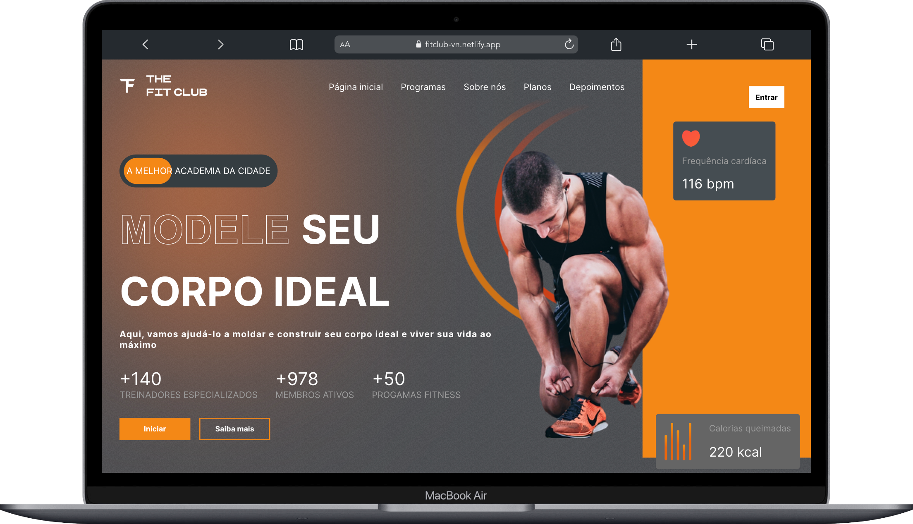

## Projeto Gym FitClub 🏋🏼

----
📝Proposta: Criar um incrível #site responsivo de academia. A aplicação foi feita em #react combinada com #css moderno e JavaScript. Para deixar o site mais funcional e prático, foi utilizado a biblioteca E-mail #js, onde o usuário consegue inserir seu e-mail para contato e o mesmo é enviado para a caixa de E-mail do responsável pelo site. Além dessa, houve manipulação de outras bibliotecas em React, tais como React Framer motion e React scroll.

💡Foi bem desafiador, pois não tinha conhecimento das bibliotecas citadas acima e foi o projeto mais extenso que pratiquei até o momento. No entanto, estou bem feliz com o resultado.

----
#### Navegue aqui 🏋🏼 [Fitclub](https://fitclub-vn.netlify.app/) ✅
----

### 💡 Conhecimentos aplicados:
- HTML
- CSS
- React
- JavaScript 
- Responsividade 📱
- Manipulação da biblioteca [Email Js](https://www.emailjs.com/docs/examples/reactjs/)
- Manipulação da biblioteca [React scroll](https://www.npmjs.com/package/react-scroll)
- Manipulação da biblioteca [React framer motion](https://www.npmjs.com/package/framer-motion)
---
### 🔗 Linkedin [@vitornogueira](https://www.linkedin.com/in/vitor-noqueira-913a9284/) ✅
---
